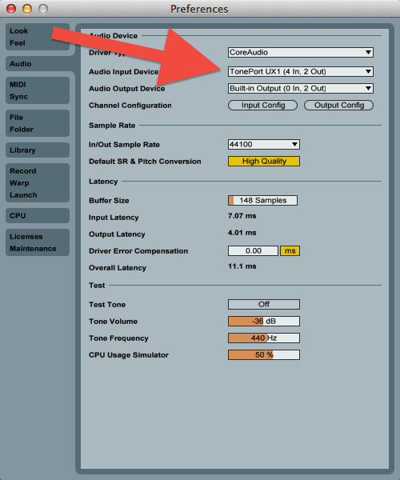
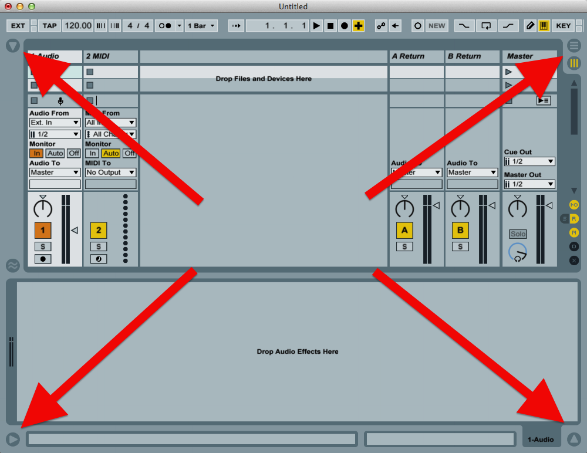

Introduction to Music Production - Assignment 1
================================================================================

March 10, 2013

Record an acoustic/electric ukulele with Ableton Live
--------------------------------------------------------------------------------

I'm [Patrick Mueller](http://muellerware.org) from Raleigh, North Carolina.
This lesson is an assignment for week 1 of 
[Introduction To Music Production](https://class.coursera.org/musicproduction-001/class/index) 
at [Coursera](http://coursera.org). 
I will teach you how to record an acoustic/electric ukulele into Ableton Live.
This is really no different than recording an electric or acoustic/electric 
guitar into Ableton Live, but a little sillier and so more fun.

Equipment used for this lesson:

* [Lanikai LU-21TE/BK](http://lanikaiukes.com/laniblog/ukuleles/discontinued/lu-21tebk-tenor-size-ae-black-ukulele/) acoustic/electic ukulele
* Standard electric guitar cable aka TS cable aka instrument cable
* Line 6 Toneport guitar to USB interface box (an older version of 
  the [Line 6 Pod Studio](http://line6.com/podstudioux1/))
* Standard USB cable
* [Ableton Live 9](https://www.ableton.com/en/live/)
* MacBook Pro

The Line6 Toneport is an inexpensive audio interface well suited for guitar,
but you can use any audio interface that will take an instrument input
and allow you to plug into your computer.

To get started, let's hook all the cables up.

Remember that before plugging cables in, 
you want to dial down the appropriate volume levels on your
devices, to avoid any clicks or pops.

1. Plug the electric guitar cable into your ukulele.
2. Plug the other end of the guitar cable into the Toneport.
3. Plug the USB cable into the Toneport.
4. Plug the other end of the USB cable into your computer.

Here's a diagram of the hookup:

&nbsp;

And here are some actual photos of the hookup:

guitar cable plugged into the uke:

&nbsp;

cables plugged into the TonePort;
left: guitar cable from the uke; 
right: USB to computer

&nbsp;

USB cable plugged into computer:

&nbsp;

There you go, the signal from the ukulele can now make it all the way into your
computer.

Before starting Live, let's make sure the volume level on the
computer is set high enough.  This
is critical, as there isn't much signal to work with coming from the ukulele,
and the TonePort doesn't amplify much.  

Open System
Preferences (from the Apple menu at the top left of the display) and
select the Sound icon.  Click on the Input tab, and you should see something
like below.  You will want to set the Input volume to the highest level,
as indicated by the red arrow.

&nbsp;

Time to start Live.  We need to set the TonePort as the audio input device.
Do that from the Preferences Panel, in the Audio section.  On that page, there's a
drop-down list labelled Audio Input Device.  The TonePort is listed here, so
select it.  The Preferences Panel will then look like this:

&nbsp;

Now we're ready to play with the Live user interface.  I like to work in 
Arrangement View (compared to Session View) and like most of the panels hidden.

To hide panels, you can click the arrow buttons pointed to by the red arrows
on the top left and the two red arrows on the bottom.  To switch between 
Arrangement and Session Views,
use the buttons pointed to by the red arrow on the top right.

&nbsp;

To prepare for recording, we need to do two things: increase the track volume,
and arm the track for recording.

To increase the track volume, click in the area pointed to by the arrow on the
left.  After clicking, you can use your computer's up- and down- arrow keys
to change the value.  I set it to the max, which is 6.

To arm the track for recording, click on the black circle pointed to by the
arrow on the right.  The black circle will turn red when the track is armed,
as shown in later images.

&nbsp;

Next thing to do: record!  Press the record button - with a circle in it - pointed to by the red arrow,
and Live will begin recording.  

&nbsp;

The stop button - with a square in it - pointed to by the red arrow - can be used
to stop recording.

&nbsp;

Now you'll want to play it back, using the play button - with a triangle in it - 
pointed to by the red arrow.

You will also have to click the monitoring button "Auto" - pointed to
by the red arrow - in order to hear the audio.  If it's set to "In", you 
won't be able to hear it.

&nbsp;

That's it!  Congratulations!  Now that you have some audio recorded in wave,
there are lots of fun things you can do with it.

I recorded a short clip of the uke, and then applied three different audio
effects to it, and uploaded them all to [SoundCloud](https://soundcloud.com/),
right from Live.

Here are the clips:

1. the original recording of the uke
2. using the audio effect "Amp" with the preset "Metalic"
3. using the audio effect "Grain Delay" with the preset "Ascent"
4. using the audio effect "Vocoder" with the preset "Chromatic"

<iframe width="100%" height="166" scrolling="no" frameborder="no" src="https://w.soundcloud.com/player/?url=http%3A%2F%2Fapi.soundcloud.com%2Ftracks%2F82533852"></iframe>
<iframe width="100%" height="166" scrolling="no" frameborder="no" src="https://w.soundcloud.com/player/?url=http%3A%2F%2Fapi.soundcloud.com%2Ftracks%2F82534127"></iframe>
<iframe width="100%" height="166" scrolling="no" frameborder="no" src="https://w.soundcloud.com/player/?url=http%3A%2F%2Fapi.soundcloud.com%2Ftracks%2F82534299"></iframe>
<iframe width="100%" height="166" scrolling="no" frameborder="no" src="https://w.soundcloud.com/player/?url=http%3A%2F%2Fapi.soundcloud.com%2Ftracks%2F82534426"></iframe>

One last tip for guitar/uke players.  You may want to invest in a MIDI-capable
foot controller, which will allow you to have some control over your 
software with your otherwise unused feet.  I use a 
[Line 6 FBV Express MkII foot controller](http://line6.com/footcontrollers/fbvexpressmkii.html)
plugged into my computer, and then assign the transport play, stop, and
record buttons to the pedals using Live's MIDI remote control feature.

<!--

Trouble-Shooting
--------------------------------------------------------------------------------

* Are the batteries in your ukulele working?  Try some new ones.

* Does your USB interface box need power?  Many don't - they can get power
  from the USB cable.  But some do, and will need to be plugged into the
  wall.

* Are all the cables fully plugged into the jacks?

* Ableton.  What can you say, but that "It's complicated".  Luckily, there's
  lots of help available at the Ableton site, including:

    * [questions and answers specifically about guitar](https://www.ableton.com/answers/tags/guitar)
    * [articles describing how to get started](https://www.ableton.com/en/articles/tags/getting-started/)
    * [movies showing you how to get started](https://www.ableton.com/en/help/learn-live/#getting-started)
    * [general questions and answers about Ableton Live](https://www.ableton.com/en/help/)

About the Line 6 TonePort
--------------------------------------------------------------------------------

To connect my ukulele to my computer, I used a Line 6 Toneport interface.  With
this interface, you plug one end of a standard electric guitar cable into the
interface, and also plug a USB cable into the interface.  In the case of the
Toneport, it takes a USB Type-B plug, which is typical for USB audio devices.
Make sure you get the right USB cable!  Your computer likely uses a Type-A
plug, so you'll need a cable with Type-A on one end, and Type-B on the other.
See this [Wikipedia article](http://en.wikipedia.org/wiki/Universal_Serial_Bus#Cable_plugs_.28USB_1.x.2F2.0.29)
and pictures for more information.

There are a lot of devices available that can get signal from a guitar into a 
computer.  There
best way to see what's available, is to go to your favorite online musical
instrument store, and look around.  For instance, 
[Musician's Friend](http://www.musiciansfriend.com/audio-interfaces/usb) has
a page with just USB-capable audio interfaces, many of which will be appropriate
for using with a guitar or ukulele.  If you're unsure, make sure the description
of the interface says it supports guitar.  If it supports guitar, it will work
with ukulele's as well.  You might also want to download the manual from the
manufacturer's web site to get more information about the interface.

-->

<!-- ======================================================================= -->

&nbsp;
--------------------------------------------------------------------------------

<table>
<tr>
<td valign=top>
<td valign=top style="padding-left:1em;" >**Patrick Mueller** is a software developer living and working near Raleigh,
North Carolina.  He sometimes posts to Twitter as 
[@pmuellr](http://twitter.com/pmuellr) and dumps other stuff to his web site
<http://muellerware.org> .

The source for this assignment is available at <https://github.com/pmuellr/mooc> 
under the [Tumbolia Public License](../../LICENSE).

A short link to this assignment is <http://goo.gl/2Tycf>
</table>

&nbsp;

reflection
--------------------------------------------------------------------------------

I really like the assignment format of "create a lesson".  It's very true that 
a great way to learn something is to try to teach it to someone else.  The 
lesson content was pretty easy to put together, as I've been playing with Live
for years.  But it was great to boil it down to the exact steps needed.  One
thing that I realized was to check the System volume controls - I've forgotten
to do that in the past.  Also, got a chance to play a bit with SoundCloud - 
*very* nice!

